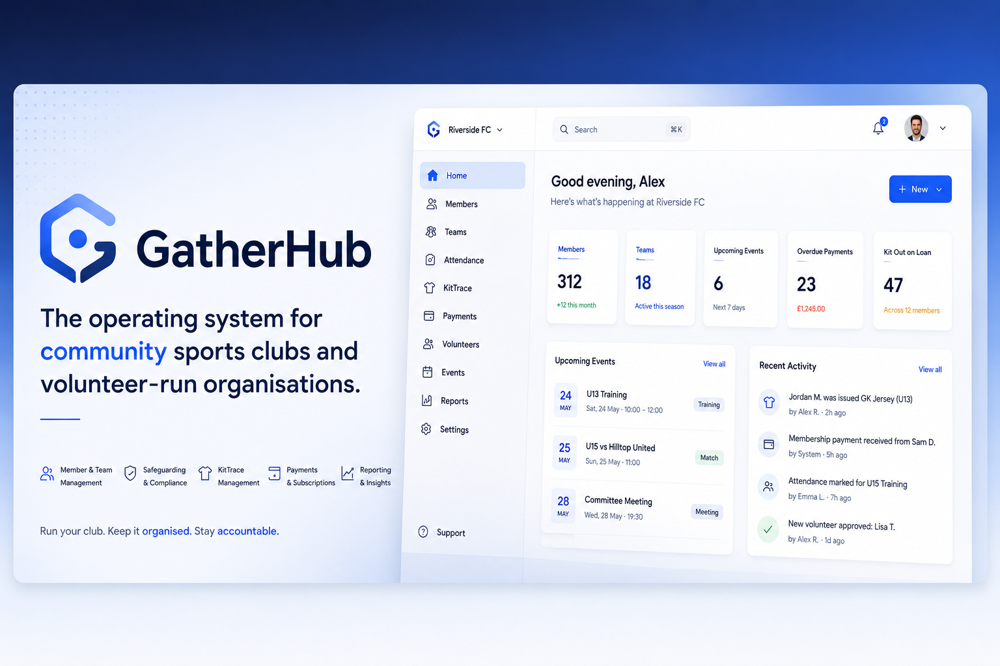

<p align="center">
  
</p>

<h1 align="center">GatherHub</h1>

<p align="center">
  <em>The operating system for community sports clubs and volunteer-run organisations.</em>
</p>

GatherHub helps club committees manage people, teams, events, attendance,
volunteers, sponsors, assets, kit, QR/NFC tracking, and a basic public website —
all from one place. It is **not** a chat app or a Spond clone; it focuses on the
club operations those tools handle poorly.

GatherHub answers the questions a committee actually has:

- Who is in the club? Which teams are active? Who is attending training?
- Who has which piece of kit? What assets are missing, damaged, or overdue?
- Which volunteers are available, and whose certifications are expiring?
- Which sponsors support the club, and what should appear on the public site?

## Highlights

- **Multi-tenant** by club, owned entirely in the Convex database — Clerk is
  used only for user identity. Every query/mutation derives the active club
  from `users.activeOrgId` on the server, never from client input.
- **KitTrace** — first-class asset/kit tracking with QR codes, an NFC-ready data
  model, full check-out/in/transfer/lost/maintenance/retire operations, and an
  **immutable audit log** for every action.
- **Safe public QR routes** — QR/NFC tags carry only an opaque id; the backend
  enforces permissions before revealing anything, and the public landing page
  shows only "return to owner" information.
- **Role-aware** access control (Owner, Admin, Committee, Coach, Volunteer,
  Parent, Player) checked on the server, never trusted from the client.
- **Public club website** generated from your data (home, about, teams,
  sponsors, news, contact).
- **Configurable sport packs** — soccer remains backward compatible, while
  rugby union, rugby league, cricket, hockey, netball, basketball, and
  multi-sport clubs can use sport-specific terminology without enabling
  soccer-only storage.
- **Multi-sport fixtures and match day** — shared seasons, competitions,
  divisions, venues, fixtures, standings, team sheets, position templates,
  bench/interchange tracking, and participation logs for common team sports.
- **iOS field-ops app** (SwiftUI) for scanning and checking kit in/out on the
  sideline, browsing offline-cached fixtures, and queueing match-day attendance
  and participation updates while offline.

## Tech stack

| Layer       | Choice                                                        |
| ----------- | ------------------------------------------------------------- |
| Frontend    | React + TypeScript + Vite + Tailwind + shadcn-style (Radix)   |
| Routing     | React Router v6                                               |
| Backend     | Convex (database and serverless functions)                    |
| Files       | Cloudflare R2 using org-scoped object paths                   |
| Auth        | Clerk (identity only — clubs live in Convex)                  |
| Mobile      | SwiftUI + Clerk iOS SDK + Convex Swift client                 |
| QR / NFC    | `qrcode` (web), AVFoundation + Core NFC (iOS)                 |

The web app and the iOS app both talk **directly** to Convex using
Clerk-authenticated sessions. There is no separate REST API except for the
documented exceptions (public QR landing pages, Clerk webhooks).

## Repository layout

```
GatherHub/
├── web/                  # Vite + React web app
│   ├── src/              # UI, pages, components, hooks
│   └── convex/           # Convex schema + functions (the authoritative backend)
├── ios/                  # SwiftUI field-ops app scaffold (XcodeGen project)
├── docs/                 # Architecture, data model, security, KitTrace, roadmap
│   └── issues/           # Full GitHub issue roadmap (16 epics, 165 issues)
└── package.json          # npm workspaces root
```

## Quick start

### Prerequisites

- Node.js 20+
- A [Convex](https://convex.dev) account
- A [Clerk](https://clerk.com) account (Organizations feature **not** required —
  clubs are managed in Convex)

### 1. Install

```bash
npm install
```

### 2. Configure Clerk

1. Create a Clerk application. Leave the Organizations feature **disabled** —
   GatherHub manages clubs itself.
2. Create a **JWT template named `convex`** (Clerk → JWT Templates → Convex)
   using the default claims. No org claims are needed.
3. Copy your **Publishable key**.

### 3. Configure Convex

```bash
cd web
npx convex dev        # creates a deployment, prints the deployment URL
```

In the Convex dashboard (or via `npx convex env set`), set:

- `CLERK_JWT_ISSUER_DOMAIN` — your Clerk Frontend API URL
  (e.g. `https://your-app.clerk.accounts.dev`).
- `CLERK_SECRET_KEY` — Clerk secret key used to create invitations and sync
  accepted-invite metadata.
- `PUBLIC_APP_URL` — where invited users should land, e.g.
  `http://localhost:5173` locally or your deployed app URL.
- `CLERK_WEBHOOK_SECRET` — optional signing secret if you wire up the Clerk
  webhook at `<CONVEX_SITE_URL>/clerk-webhook`.
- `R2_ACCOUNT_ID`, `R2_BUCKET`, `R2_ACCESS_KEY_ID`, `R2_SECRET_ACCESS_KEY` —
  Cloudflare R2 bucket credentials for uploaded images/documents.

Leave `R2_ENDPOINT` unset unless you need an explicit S3 API endpoint. If set,
it must be the Cloudflare R2 S3 API endpoint, for example
`https://<account-id>.r2.cloudflarestorage.com`, not an `r2.dev` public bucket
URL or a custom domain.

The R2 bucket CORS policy must allow browser `PUT` requests from the web app
origin. GatherHub uploads file bytes without custom browser request headers, so
`AllowedHeaders` can be omitted. In the Cloudflare R2 bucket settings, the JSON
policy should look like this, with no trailing slash on each origin:

```json
[
  {
    "AllowedOrigins": [
      "http://localhost:5173",
      "https://your-production-app.example"
    ],
    "AllowedMethods": ["PUT", "GET", "HEAD"],
    "ExposeHeaders": ["ETag"],
    "MaxAgeSeconds": 3600
  }
]
```

Authenticated HTTP clients can request an upload URL without the Convex SDK:

```bash
curl -X POST "$CONVEX_SITE_URL/files/upload-url" \
  -H "Authorization: Bearer $CONVEX_JWT" \
  -H "Content-Type: application/json" \
  -d '{
    "ownerType": "sponsors",
    "ownerId": "<sponsor-id>",
    "purpose": "logo",
    "fileName": "logo.png",
    "contentType": "image/png",
    "size": 12345
  }'
```

The response includes `uploadUrl`, `storageId`, `objectKey`, required request
`headers`, and `expiresInSeconds`.

For training certificate documents, use the same flow with
`ownerType: "certifications"`, `purpose: "document"`, a certification record id
as `ownerId`, and either an allowed image content type or `application/pdf`.

### 4. Environment variables

Copy and fill in the web env file:

```bash
cp web/.env.example web/.env.local
```

| Variable                       | Description                              |
| ------------------------------ | ---------------------------------------- |
| `VITE_CONVEX_URL`              | Convex deployment URL                    |
| `VITE_CLERK_PUBLISHABLE_KEY`   | Clerk publishable key                    |
| `VITE_PUBLIC_APP_URL`          | Base URL used in generated QR links      |
| `VITE_GOOGLE_MAPS_API_KEY`     | Google Places address lookup key         |

Local dev also accepts `VITE_GOOGLE_MAPS_KEY` as a fallback alias, but hosted
deployments should use `VITE_GOOGLE_MAPS_API_KEY`. The key's Google Cloud
project must have both Maps JavaScript API and Places API (New) enabled.

### 5. Run

In two terminals:

```bash
npm run convex:dev    # Convex functions (watch mode)
npm run dev           # Vite dev server → http://localhost:5173
```

Sign in and use the club switcher in the top bar to **create a club** or **join
one with an invite code**. Either action sets the club as your active org. The
app syncs your Clerk user into Convex automatically on first load; clubs and
memberships are created entirely in-app.

### 6. Seed demo data (optional)

```bash
npm run seed          # creates the "Demo United FC" demo club
```

Then, signed in, run `npx convex run seed:claimDemo` to grant yourself owner
membership on the demo club and switch to it. The public site for the demo
club is at `/club/demo-united`.

## iOS app

See [`ios/README.md`](ios/README.md). In short: install XcodeGen, run
`xcodegen generate`, add the Clerk iOS and Convex Swift Package dependencies,
fill in `ios/GatherHub/Config/Secrets.swift`, and build.

## Documentation

- [Sport packs](docs/sport-packs.md)
- [Architecture](docs/architecture.md)
- [Data model](docs/data-model.md)
- [Security model](docs/security-model.md)
- [Mobile architecture](docs/mobile-architecture.md)
- [KitTrace](docs/kittrace.md)
- [Roadmap](docs/roadmap.md)
- [Issue roadmap](docs/issues/README.md) — 16 epics, 165 issues
- [Contributing](CONTRIBUTING.md)
- [Self-hosting & deployment](docs/deployment.md)

## Scope

This MVP deliberately **excludes** chat, payments, and AI features. See
[`docs/roadmap.md`](docs/roadmap.md) for the v0.1 definition of done.

## License

[MIT](LICENSE)
