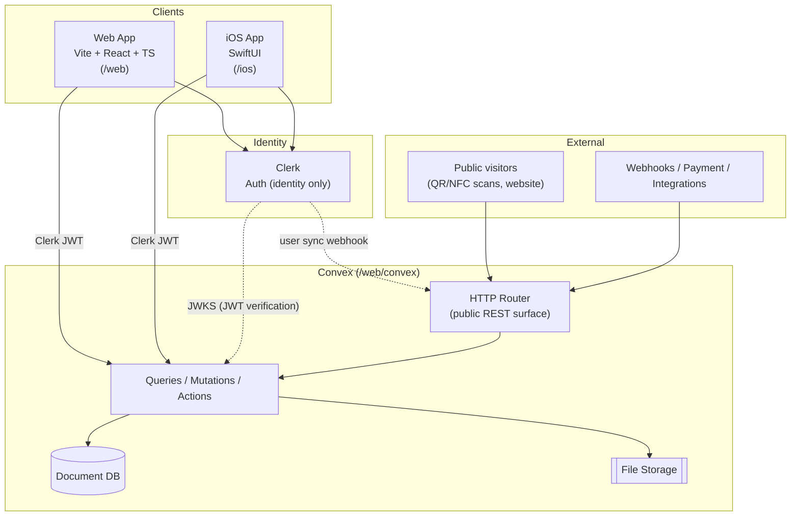
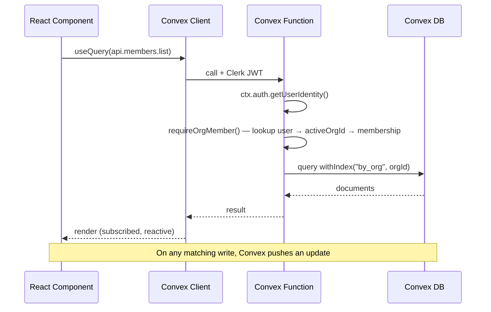
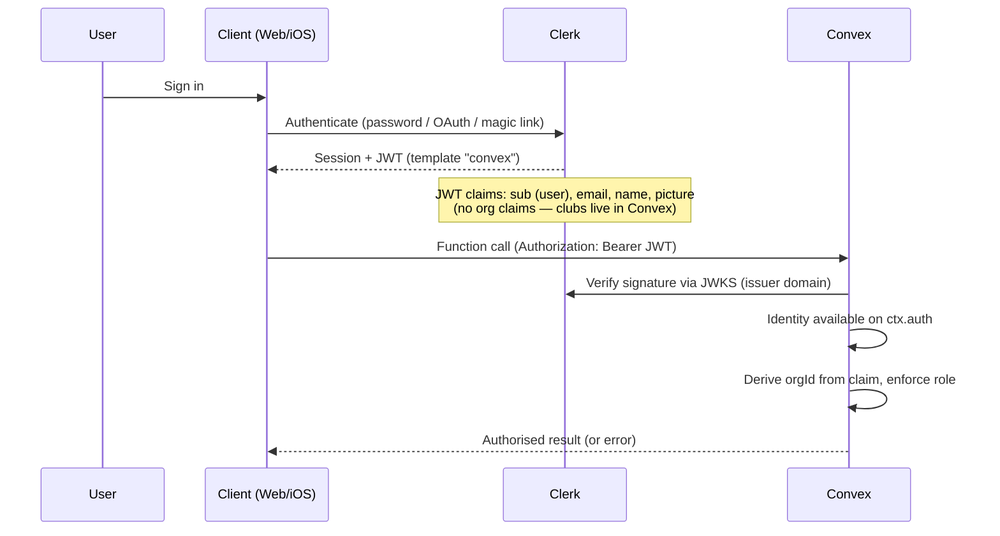
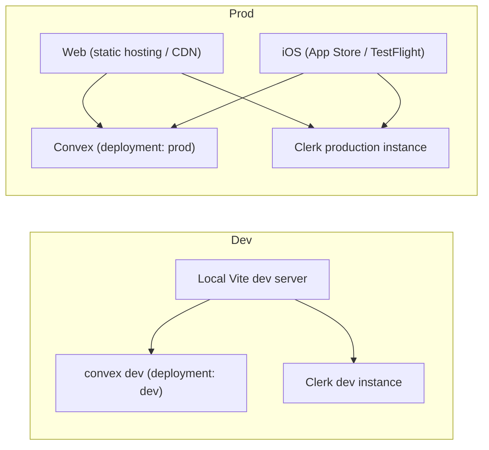

# GatherHub — Architecture

GatherHub is a modern operating system for community sports clubs and volunteer-run
organisations. It manages people, teams, events, attendance, volunteers, sponsors,
assets, kit, and QR/NFC tracking, plus a basic public website — all from one place.

GatherHub is **not** a chat-first app. It focuses on the club operations that
chat-first tools (e.g. Spond) handle poorly: asset/kit tracking via QR/NFC,
volunteer management, sponsor management, and a public website.

---

## 1. System overview

GatherHub is a **monorepo** containing three deployable surfaces that share one
authoritative backend:

| Surface | Path | Stack | Talks to |
| --- | --- | --- | --- |
| Web app | `/web` | Vite + React 18 + TypeScript + React Router v6 + Tailwind CSS + shadcn-style components on Radix | Convex (directly) + Clerk (identity only) |
| Backend | `/web/convex` | Convex (DB + serverless functions) + Cloudflare R2 object storage | — (it *is* the backend, and owns club/membership state) |
| iOS app | `/ios` | SwiftUI + Clerk iOS SDK + Convex Swift client | Convex (directly) + Clerk (identity only) |

The core architectural decision: **both clients talk directly to Convex** using a
Clerk-authenticated session. Convex validates the Clerk-issued JWT on every
function call. There is no general-purpose REST API tier between clients and
the database.



---

## 2. Data flow

### 2.1 Web ↔ Convex

1. The React app initialises the Convex client (`ConvexReactClient`) wrapped by
   `ConvexProviderWithClerk`, which wires Clerk's session token into every
   Convex request.
2. Components use `useQuery` / `useMutation` hooks. Queries are **reactive**:
   when underlying documents change, subscribed components re-render
   automatically over Convex's websocket subscription.
3. Every function call carries the Clerk JWT. Convex verifies it and exposes the
   identity via `ctx.auth.getUserIdentity()`.
4. The server resolves the caller's `orgId` from the verified identity — never
   from a client-supplied argument (see `security-model.md`).



### 2.2 iOS ↔ Convex

The iOS app uses the same model: the Clerk iOS SDK manages the session, and the
Convex Swift client attaches the Clerk JWT to each call. iOS is **field-ops
focused** (asset lookup, QR/NFC scan, check-out/check-in, event RSVP), not a
full admin console. See `mobile-architecture.md`.

### 2.3 Clerk JWT auth flow



- Clerk issues a JWT using a JWT template named `convex`. Convex is configured
  with Clerk's issuer domain in `convex/auth.config.ts`.
- The JWT carries **identity only** (subject, email, name, picture). The
  active club is read from `users.activeOrgId` in Convex and validated against
  the `memberships` table — Clerk Organizations are not used.

---

## 3. Multi-tenancy

**Clubs are Convex-native.** A club = an `organizations` row = an `orgId`
scope. Clerk is responsible for "who is this user" only — it does not know
about clubs.

- A user can belong to many clubs. Memberships are stored in the Convex
  `memberships` table and managed in-app (`organizations.create`,
  `organizations.joinByCode`, `organizations.leave`).
- The active club is tracked per user on `users.activeOrgId` and switched via
  `organizations.setActive`. The in-app `<OrgSwitcher>` component drives this.
- Every tenant-owned table carries an `orgId` field and a `by_org` index.
- All queries/mutations filter by `orgId` resolved from `users.activeOrgId` +
  a `memberships` lookup. This is the cornerstone of data isolation (see
  `security-model.md`).

Roles within a club: **Owner, Admin, Committee, Coach, Volunteer, Parent,
Player**. The role is stored on the `memberships` row. Whoever creates a club
becomes its first `owner`; admins promote/demote others via `roles.updateRole`.

---

## 4. Why Vite + Convex + Clerk

| Choice | Rationale |
| --- | --- |
| **Vite + React 18 + TS** | Fast dev server / HMR, first-class TypeScript, simplest path to a SPA that talks directly to Convex. No SSR complexity needed for an admin console. |
| **Tailwind + shadcn/Radix** | Accessible-by-default primitives (Radix), unstyled and ownable components (shadcn pattern), rapid consistent UI without a heavyweight component library. |
| **Convex** | One backend for DB + serverless functions + realtime subscriptions. End-to-end TypeScript types from schema to client. Reactive queries remove most state-sync glue. Server functions are the natural place to enforce org-scoping and RBAC. |
| **Cloudflare R2** | S3-compatible object storage for uploaded files. Convex issues scoped object paths, records metadata, validates ownership, and resolves URLs. |
| **Clerk** | Drop-in auth with native React + iOS SDKs and JWT templates that integrate cleanly with Convex. Used purely for identity — clubs and memberships are owned by Convex so tenancy stays under our control and is enforceable in tests. |
| **Direct client → Convex** | Removes an entire REST/API-gateway tier. Fewer moving parts, fewer auth boundaries to secure, less code for an MVP. |

---

## 5. Monorepo layout

```text
GatherHub/
├── web/                      # Vite + React + TS web app
│   ├── src/
│   │   ├── components/       # shadcn-style UI on Radix
│   │   ├── routes/           # React Router v6 routes
│   │   ├── features/         # members, teams, events, kittrace, sponsors, ...
│   │   ├── lib/              # convex client, clerk helpers
│   │   └── main.tsx
│   ├── convex/               # Convex backend (authoritative)
│   │   ├── schema.ts         # data model (see data-model.md)
│   │   ├── auth.config.ts    # Clerk issuer config
│   │   ├── http.ts           # public REST surface (HTTP router)
│   │   ├── lib/
│   │   │   └── auth.ts        # requireOrgMember / requireRole helpers
│   │   ├── members.ts        # queries + mutations per module
│   │   ├── teams.ts
│   │   ├── events.ts
│   │   ├── assets.ts         # KitTrace
│   │   ├── assetOps.ts       # check-out/in, transfer, audit
│   │   ├── sponsors.ts
│   │   └── publicSite.ts
│   ├── package.json
│   └── vite.config.ts
├── ios/                      # SwiftUI app (field ops)
│   ├── GatherHub/
│   │   ├── App/
│   │   ├── Features/         # AssetLookup, Scan, Events
│   │   ├── Services/         # ClerkClient, ConvexClient
│   │   └── Resources/
│   └── GatherHub.xcodeproj
└── docs/                     # this documentation
    ├── architecture.md
    ├── data-model.md
    ├── security-model.md
    ├── mobile-architecture.md
    ├── kittrace.md
    └── roadmap.md
```

> Note: Convex lives **inside** `/web` (`/web/convex`) because the Convex CLI and
> generated types are colocated with the web package, but it is the shared
> backend for both web and iOS.

---

## 6. Public REST surface (the only exceptions)

Everything authenticated goes through Convex functions over the Clerk-validated
session. The **only** HTTP/REST endpoints (served by Convex's HTTP router in
`convex/http.ts`, or an equivalent edge handler) are:

| Endpoint class | Purpose | Auth |
| --- | --- | --- |
| **Public QR/NFC landing** | `GET /a/:tagId` — resolves an opaque asset tag to a minimal, permission-gated landing page/redirect. No private data exposed. | None (opaque tag id) |
| **Webhooks** | Clerk org/user sync, generic inbound webhooks. | Signature verification |
| **Payment providers** | Future payment provider callbacks (out of MVP scope). | Provider signature |
| **Integrations** | Inbound/outbound third-party integration endpoints. | Per-integration secret |
| **Unauthenticated invite links** | Accept-invite flow before a session exists. | Single-use signed token |

No other REST API exists. CRUD for members, teams, events, assets, sponsors,
etc. is **only** reachable as authenticated Convex functions.

> QR/NFC tag ids are **opaque** (e.g. `tag_abc123`). Resolving a tag returns
> private asset data **only** after the backend confirms the viewer is an
> authenticated member of the owning org with sufficient role. See
> `security-model.md` and `kittrace.md`.

---

## 7. Environment & deployment topology



### Environments

| Environment | Web | Convex | Clerk |
| --- | --- | --- | --- |
| **Development** | `vite dev` (localhost) | `npx convex dev` (per-developer dev deployment) | Clerk development instance |
| **Preview/Staging** | Preview deploy of static build | Convex preview deployment | Clerk dev/staging instance |
| **Production** | Static build served from CDN/static host | Convex production deployment | Clerk production instance |

### Key configuration

- **Web** (`.env.local`): `VITE_CONVEX_URL`, `VITE_CLERK_PUBLISHABLE_KEY`.
- **Convex** (deployment env vars): `CLERK_JWT_ISSUER_DOMAIN` (consumed by
  `auth.config.ts`), `CLERK_WEBHOOK_SECRET`, plus any integration secrets.
- **iOS**: Clerk publishable key + Convex deployment URL injected via build
  configuration.

### Deployment notes

- The web app is a static SPA — deploy the Vite build output to any static host
  / CDN.
- Convex deploys via `npx convex deploy`; functions and schema ship together and
  Convex enforces the schema on write.
- Cloudflare R2 holds uploaded files (member photos, asset photos, sponsor
  logos, news images, and future documents). Convex owns object metadata,
  validation, org-scoped path issuance, and URL resolution — see
  `security-model.md`.
- iOS ships through TestFlight/App Store; it targets the production Convex URL
  and Clerk production instance.
