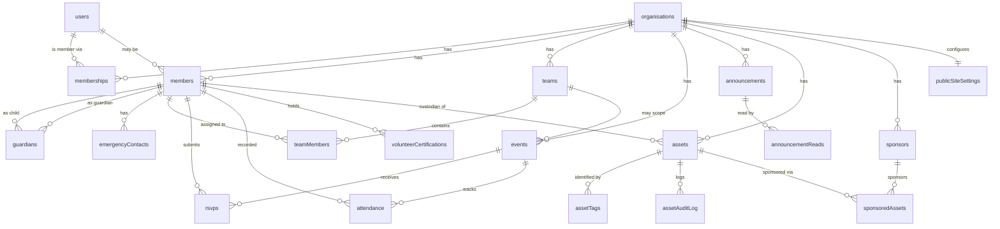

# GatherHub — Data Model

This document defines the full Convex data model (`/web/convex/schema.ts`) for
every GatherHub module. Convex is a document database; each "table" below is a
Convex table defined with `defineTable`. Every document gets an automatic `_id`
(typed `Id<"table">`) and `_creationTime` (epoch ms) — these are not repeated in
the field lists.

## Conventions

- **Org scoping.** Every tenant-owned table carries `orgId: Id<"organisations">`
  and a `by_org` index. All queries derive `orgId` from the authenticated Clerk
  session, never from client input (see `security-model.md`).
- **Mirrors of Clerk.** `organisations` and `users` mirror Clerk
  organisations/users (kept in sync via webhook). They hold a stable
  `clerkId`/`clerkOrgId` plus cached display fields.
- **Members vs users.** A **member** is a person in a club and may *not* be a
  GatherHub `user` (e.g. a child player, or an adult who never signs in). When a
  member is also a user, `members.userId` links them.
- **Soft references.** Cross-table references use `Id<"...">`. Optional links use
  `v.optional(v.id("..."))`.
- **Field types** use Convex validator notation (`v.string()`, `v.number()`,
  `v.boolean()`, `v.id()`, `v.optional()`, `v.union(v.literal(...))`, etc.).

---

## Enums

```ts
// Application roles (mapped from Clerk org_role). Ordered most → least privileged.
export const roles = v.union(
  v.literal("owner"),
  v.literal("admin"),
  v.literal("committee"),
  v.literal("coach"),
  v.literal("volunteer"),
  v.literal("parent"),
  v.literal("player"),
);

// Asset categories (KitTrace)
export const assetCategory = v.union(
  v.literal("uniform"),
  v.literal("kit_bag"),
  v.literal("ball"),
  v.literal("training_equipment"),
  v.literal("goal"),
  v.literal("gazebo"),
  v.literal("first_aid"),
  v.literal("key"),
  v.literal("device"),
  v.literal("vehicle"),
  v.literal("other"),
);

// Asset statuses (KitTrace lifecycle)
export const assetStatus = v.union(
  v.literal("available"),
  v.literal("checked_out"),
  v.literal("in_use"),
  v.literal("maintenance"),
  v.literal("lost"),
  v.literal("retired"),
);

// Event types
export const eventType = v.union(
  v.literal("training"),
  v.literal("match"),
  v.literal("meeting"),
);

// RSVP statuses
export const rsvpStatus = v.union(
  v.literal("going"),
  v.literal("not_going"),
  v.literal("maybe"),
);

// Tag kinds (QR vs NFC)
export const tagKind = v.union(v.literal("qr"), v.literal("nfc"));

// Asset audit log actions (append-only)
export const assetAction = v.union(
  v.literal("created"),
  v.literal("edited"),
  v.literal("qr_generated"),
  v.literal("nfc_registered"),
  v.literal("checked_out"),
  v.literal("checked_in"),
  v.literal("transferred"),
  v.literal("reported_lost"),
  v.literal("maintenance_started"),
  v.literal("maintenance_ended"),
  v.literal("retired"),
);
```

| Enum | Values |
| --- | --- |
| Roles | owner, admin, committee, coach, volunteer, parent, player |
| Asset category | Uniform, Kit Bag, Ball, Training Equipment, Goal, Gazebo, First Aid, Key, Device, Vehicle, Other |
| Asset status | Available, Checked Out, In Use, Maintenance, Lost, Retired |
| Event type | training, match, meeting |
| RSVP status | going, not_going, maybe |

---

## ER diagram



---

## Tables

### organisations
Mirrors a Clerk organisation; one row per club/tenant.

| Field | Type | Notes |
| --- | --- | --- |
| `clerkOrgId` | `v.string()` | Clerk organisation id; unique. |
| `name` | `v.string()` | Club name (cached from Clerk). |
| `slug` | `v.string()` | URL slug (cached from Clerk). |
| `logoStorageId` | `v.optional(v.id("_storage"))` | Club logo in Convex storage. |
| `timezone` | `v.string()` | IANA tz, default `Australia/Sydney`. |
| `createdByUserId` | `v.optional(v.id("users"))` | Creator. |

**Org-scoping field:** *(is the org)* — `clerkOrgId`.
**Indexes:** `by_clerkOrgId` `["clerkOrgId"]`, `by_slug` `["slug"]`.

### users
Mirrors a Clerk user. Global (not org-scoped); org membership is via `memberships`.

| Field | Type | Notes |
| --- | --- | --- |
| `clerkUserId` | `v.string()` | Clerk user id; unique. |
| `email` | `v.string()` | Primary email (cached). |
| `firstName` | `v.optional(v.string())` | |
| `lastName` | `v.optional(v.string())` | |
| `imageUrl` | `v.optional(v.string())` | Clerk avatar URL. |

**Org-scoping field:** none (global).
**Indexes:** `by_clerkUserId` `["clerkUserId"]`, `by_email` `["email"]`.

### memberships
User ↔ org link carrying the application role. Mirrors Clerk org membership.

| Field | Type | Notes |
| --- | --- | --- |
| `orgId` | `v.id("organisations")` | |
| `userId` | `v.id("users")` | |
| `role` | `roles` | Mapped from Clerk `org_role`. |
| `active` | `v.boolean()` | Suspended memberships set `false`. |

**Org-scoping field:** `orgId`.
**Indexes:** `by_org` `["orgId"]`, `by_user` `["userId"]`, `by_org_user` `["orgId","userId"]`.

### members
A person in a club. May or may not be a `user`.

| Field | Type | Notes |
| --- | --- | --- |
| `orgId` | `v.id("organisations")` | |
| `userId` | `v.optional(v.id("users"))` | Set if this member can sign in. |
| `firstName` | `v.string()` | |
| `lastName` | `v.string()` | |
| `dateOfBirth` | `v.optional(v.string())` | ISO date; used for minor detection. |
| `email` | `v.optional(v.string())` | |
| `phone` | `v.optional(v.string())` | |
| `photoStorageId` | `v.optional(v.id("_storage"))` | |
| `medicalNotes` | `v.optional(v.string())` | **Restricted visibility** (see security-model). |
| `isMinor` | `v.optional(v.boolean())` | Derived/cached from DOB. |
| `status` | `v.union(v.literal("active"), v.literal("inactive"))` | |

**Org-scoping field:** `orgId`.
**Indexes:** `by_org` `["orgId"]`, `by_org_user` `["orgId","userId"]`, `by_org_lastName` `["orgId","lastName"]`.

### guardians
Member ↔ member parent/guardian links (e.g. parent → child player).

| Field | Type | Notes |
| --- | --- | --- |
| `orgId` | `v.id("organisations")` | |
| `childMemberId` | `v.id("members")` | The minor/dependent. |
| `guardianMemberId` | `v.id("members")` | The parent/guardian. |
| `relationship` | `v.optional(v.string())` | "Mother", "Carer", etc. |
| `isPrimary` | `v.boolean()` | Primary guardian flag. |

**Org-scoping field:** `orgId`.
**Indexes:** `by_org` `["orgId"]`, `by_child` `["childMemberId"]`, `by_guardian` `["guardianMemberId"]`.

### emergencyContacts
Emergency contacts for a member (free-form, not necessarily a member).

| Field | Type | Notes |
| --- | --- | --- |
| `orgId` | `v.id("organisations")` | |
| `memberId` | `v.id("members")` | |
| `name` | `v.string()` | |
| `phone` | `v.string()` | |
| `relationship` | `v.optional(v.string())` | |
| `priority` | `v.number()` | Ordering (1 = first). |

**Org-scoping field:** `orgId`.
**Indexes:** `by_org` `["orgId"]`, `by_member` `["memberId"]`.

### teams
A team within a club.

| Field | Type | Notes |
| --- | --- | --- |
| `orgId` | `v.id("organisations")` | |
| `name` | `v.string()` | |
| `ageGroup` | `v.optional(v.string())` | "U12", "Seniors". |
| `season` | `v.optional(v.string())` | "2026". |
| `description` | `v.optional(v.string())` | |
| `active` | `v.boolean()` | |

**Org-scoping field:** `orgId`.
**Indexes:** `by_org` `["orgId"]`, `by_org_season` `["orgId","season"]`.

### teamMembers
Assignment of a member to a team with a team role.

| Field | Type | Notes |
| --- | --- | --- |
| `orgId` | `v.id("organisations")` | |
| `teamId` | `v.id("teams")` | |
| `memberId` | `v.id("members")` | |
| `teamRole` | `v.union(v.literal("player"), v.literal("coach"), v.literal("manager"))` | |
| `jerseyNumber` | `v.optional(v.number())` | Players only. |

**Org-scoping field:** `orgId`.
**Indexes:** `by_org` `["orgId"]`, `by_team` `["teamId"]`, `by_member` `["memberId"]`, `by_team_member` `["teamId","memberId"]`.

### events
Training/match/meeting.

| Field | Type | Notes |
| --- | --- | --- |
| `orgId` | `v.id("organisations")` | |
| `teamId` | `v.optional(v.id("teams"))` | Null = club-wide. |
| `type` | `eventType` | training / match / meeting. |
| `title` | `v.string()` | |
| `description` | `v.optional(v.string())` | |
| `location` | `v.optional(v.string())` | |
| `startsAt` | `v.number()` | Epoch ms. |
| `endsAt` | `v.optional(v.number())` | Epoch ms. |
| `opponent` | `v.optional(v.string())` | Matches. |
| `createdByUserId` | `v.id("users")` | |
| `cancelled` | `v.boolean()` | |

**Org-scoping field:** `orgId`.
**Indexes:** `by_org` `["orgId"]`, `by_org_startsAt` `["orgId","startsAt"]`, `by_team` `["teamId"]`.

### rsvps
A member's RSVP to an event. One per (event, member).

| Field | Type | Notes |
| --- | --- | --- |
| `orgId` | `v.id("organisations")` | |
| `eventId` | `v.id("events")` | |
| `memberId` | `v.id("members")` | |
| `status` | `rsvpStatus` | going / not_going / maybe. |
| `respondedByUserId` | `v.optional(v.id("users"))` | E.g. parent RSVPing for child. |
| `note` | `v.optional(v.string())` | |

**Org-scoping field:** `orgId`.
**Indexes:** `by_org` `["orgId"]`, `by_event` `["eventId"]`, `by_member` `["memberId"]`, `by_event_member` `["eventId","memberId"]`.

### attendance
Recorded attendance at an event (distinct from RSVP intent).

| Field | Type | Notes |
| --- | --- | --- |
| `orgId` | `v.id("organisations")` | |
| `eventId` | `v.id("events")` | |
| `memberId` | `v.id("members")` | |
| `present` | `v.boolean()` | |
| `recordedByUserId` | `v.id("users")` | |
| `recordedAt` | `v.number()` | Epoch ms. |

**Org-scoping field:** `orgId`.
**Indexes:** `by_org` `["orgId"]`, `by_event` `["eventId"]`, `by_member` `["memberId"]`, `by_event_member` `["eventId","memberId"]`.

### announcements
Club/team announcements.

| Field | Type | Notes |
| --- | --- | --- |
| `orgId` | `v.id("organisations")` | |
| `teamId` | `v.optional(v.id("teams"))` | Null = club-wide. |
| `title` | `v.string()` | |
| `body` | `v.string()` | |
| `authorUserId` | `v.id("users")` | |
| `pinned` | `v.boolean()` | |
| `publishedAt` | `v.number()` | Epoch ms. |

**Org-scoping field:** `orgId`.
**Indexes:** `by_org` `["orgId"]`, `by_org_publishedAt` `["orgId","publishedAt"]`, `by_team` `["teamId"]`.

### announcementReads
Read-receipts per (announcement, member/user).

| Field | Type | Notes |
| --- | --- | --- |
| `orgId` | `v.id("organisations")` | |
| `announcementId` | `v.id("announcements")` | |
| `userId` | `v.id("users")` | |
| `readAt` | `v.number()` | Epoch ms. |

**Org-scoping field:** `orgId`.
**Indexes:** `by_org` `["orgId"]`, `by_announcement` `["announcementId"]`, `by_announcement_user` `["announcementId","userId"]`.

### assets (KitTrace)
A trackable club asset. Full field list — see `kittrace.md`.

| Field | Type | Notes |
| --- | --- | --- |
| `orgId` | `v.id("organisations")` | |
| `name` | `v.string()` | |
| `category` | `assetCategory` | |
| `status` | `assetStatus` | Current lifecycle state. |
| `description` | `v.optional(v.string())` | |
| `serialNumber` | `v.optional(v.string())` | |
| `purchaseDate` | `v.optional(v.string())` | ISO date. |
| `purchaseCost` | `v.optional(v.number())` | Minor currency units (cents). |
| `condition` | `v.optional(v.union(v.literal("new"), v.literal("good"), v.literal("fair"), v.literal("poor")))` | |
| `photoStorageId` | `v.optional(v.id("_storage"))` | |
| `homeLocation` | `v.optional(v.string())` | Default storage location. |
| `currentLocation` | `v.optional(v.string())` | Where it is now. |
| `custodianMemberId` | `v.optional(v.id("members"))` | Current holder (when checked out / in use). |
| `assignedTeamId` | `v.optional(v.id("teams"))` | Team it belongs to, if any. |
| `checkedOutAt` | `v.optional(v.number())` | Epoch ms of current checkout. |
| `dueBackAt` | `v.optional(v.number())` | Expected return. |
| `notes` | `v.optional(v.string())` | |
| `retiredAt` | `v.optional(v.number())` | Epoch ms when retired. |

**Org-scoping field:** `orgId`.
**Indexes:** `by_org` `["orgId"]`, `by_org_status` `["orgId","status"]`, `by_org_category` `["orgId","category"]`, `by_custodian` `["custodianMemberId"]`, `by_team` `["assignedTeamId"]`.

### assetTags
Maps an opaque QR/NFC tag id to an asset. Tag ids are opaque and globally
unique (a scan resolves a tag without revealing private data; see security-model).

| Field | Type | Notes |
| --- | --- | --- |
| `orgId` | `v.id("organisations")` | |
| `assetId` | `v.id("assets")` | |
| `tagId` | `v.string()` | Opaque public id, e.g. `tag_abc123`. **Globally unique.** |
| `kind` | `tagKind` | qr / nfc. |
| `active` | `v.boolean()` | Deactivated tags reject lookups. |
| `registeredByUserId` | `v.id("users")` | |

**Org-scoping field:** `orgId`.
**Indexes:** `by_tagId` `["tagId"]` (global lookup), `by_org` `["orgId"]`, `by_asset` `["assetId"]`.

### assetAuditLog (immutable)
Append-only history of every asset operation. **Never updated or deleted.**

| Field | Type | Notes |
| --- | --- | --- |
| `orgId` | `v.id("organisations")` | |
| `assetId` | `v.id("assets")` | |
| `action` | `assetAction` | See enum. |
| `actorUserId` | `v.id("users")` | Who performed the action. |
| `at` | `v.number()` | Epoch ms (recorded server-side). |
| `fromStatus` | `v.optional(assetStatus)` | Status before. |
| `toStatus` | `v.optional(assetStatus)` | Status after. |
| `fromCustodianMemberId` | `v.optional(v.id("members"))` | For transfers/checkouts. |
| `toCustodianMemberId` | `v.optional(v.id("members"))` | |
| `location` | `v.optional(v.string())` | Recorded location at the time. |
| `note` | `v.optional(v.string())` | |
| `metadata` | `v.optional(v.any())` | Action-specific extra detail. |

**Org-scoping field:** `orgId`.
**Indexes:** `by_org` `["orgId"]`, `by_asset` `["assetId"]`, `by_asset_at` `["assetId","at"]`.

### volunteerCertifications
Certifications/clearances held by a volunteer member (e.g. Working With
Children Check, First Aid, Coaching accreditation).

| Field | Type | Notes |
| --- | --- | --- |
| `orgId` | `v.id("organisations")` | |
| `memberId` | `v.id("members")` | |
| `type` | `v.string()` | "WWCC", "First Aid", "Level 1 Coach". |
| `referenceNumber` | `v.optional(v.string())` | |
| `issuedAt` | `v.optional(v.string())` | ISO date. |
| `expiresAt` | `v.optional(v.string())` | ISO date — drives expiry reminders. |
| `documentStorageId` | `v.optional(v.id("_storage"))` | Scanned certificate. |
| `verifiedByUserId` | `v.optional(v.id("users"))` | |

**Org-scoping field:** `orgId`.
**Indexes:** `by_org` `["orgId"]`, `by_member` `["memberId"]`, `by_org_expiresAt` `["orgId","expiresAt"]`.

### sponsors
A club sponsor.

| Field | Type | Notes |
| --- | --- | --- |
| `orgId` | `v.id("organisations")` | |
| `name` | `v.string()` | |
| `tier` | `v.optional(v.string())` | "Gold", "Silver". |
| `logoStorageId` | `v.optional(v.id("_storage"))` | |
| `websiteUrl` | `v.optional(v.string())` | |
| `contactName` | `v.optional(v.string())` | |
| `contactEmail` | `v.optional(v.string())` | |
| `contractStart` | `v.optional(v.string())` | ISO date. |
| `contractEnd` | `v.optional(v.string())` | ISO date. |
| `active` | `v.boolean()` | |

**Org-scoping field:** `orgId`.
**Indexes:** `by_org` `["orgId"]`, `by_org_active` `["orgId","active"]`.

### sponsoredAssets
Links a sponsor to an asset they fund/brand.

| Field | Type | Notes |
| --- | --- | --- |
| `orgId` | `v.id("organisations")` | |
| `sponsorId` | `v.id("sponsors")` | |
| `assetId` | `v.id("assets")` | |
| `note` | `v.optional(v.string())` | "Branded gazebo", "Funded team kit". |

**Org-scoping field:** `orgId`.
**Indexes:** `by_org` `["orgId"]`, `by_sponsor` `["sponsorId"]`, `by_asset` `["assetId"]`.

### news (posts)
Public-site news/blog posts.

| Field | Type | Notes |
| --- | --- | --- |
| `orgId` | `v.id("organisations")` | |
| `title` | `v.string()` | |
| `slug` | `v.string()` | Unique within org. |
| `body` | `v.string()` | Markdown/HTML. |
| `coverImageStorageId` | `v.optional(v.id("_storage"))` | |
| `authorUserId` | `v.id("users")` | |
| `published` | `v.boolean()` | |
| `publishedAt` | `v.optional(v.number())` | Epoch ms. |

**Org-scoping field:** `orgId`.
**Indexes:** `by_org` `["orgId"]`, `by_org_slug` `["orgId","slug"]`, `by_org_published` `["orgId","published"]`.

### publicSiteSettings
Per-org configuration for the public website. One row per org.

| Field | Type | Notes |
| --- | --- | --- |
| `orgId` | `v.id("organisations")` | One per org. |
| `enabled` | `v.boolean()` | Public site live? |
| `tagline` | `v.optional(v.string())` | |
| `aboutHtml` | `v.optional(v.string())` | |
| `primaryColor` | `v.optional(v.string())` | Hex. |
| `heroImageStorageId` | `v.optional(v.id("_storage"))` | |
| `contactEmail` | `v.optional(v.string())` | |
| `socialLinks` | `v.optional(v.any())` | `{ facebook, instagram, x }`. |
| `showSponsors` | `v.boolean()` | Surface sponsors publicly. |
| `customDomain` | `v.optional(v.string())` | Future. |

**Org-scoping field:** `orgId`.
**Indexes:** `by_org` `["orgId"]`.

---

## Summary: org-scoping per table

| Table | Org-scoped? | Scoping field |
| --- | --- | --- |
| organisations | is the org | `clerkOrgId` |
| users | no (global) | — |
| memberships | yes | `orgId` |
| members | yes | `orgId` |
| guardians | yes | `orgId` |
| emergencyContacts | yes | `orgId` |
| teams | yes | `orgId` |
| teamMembers | yes | `orgId` |
| events | yes | `orgId` |
| rsvps | yes | `orgId` |
| attendance | yes | `orgId` |
| announcements | yes | `orgId` |
| announcementReads | yes | `orgId` |
| assets | yes | `orgId` |
| assetTags | yes (+ global `tagId`) | `orgId` |
| assetAuditLog | yes | `orgId` |
| volunteerCertifications | yes | `orgId` |
| sponsors | yes | `orgId` |
| sponsoredAssets | yes | `orgId` |
| news | yes | `orgId` |
| publicSiteSettings | yes | `orgId` |
