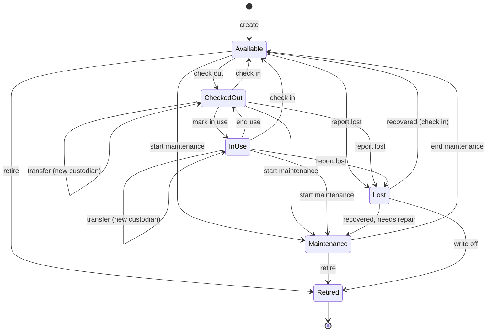
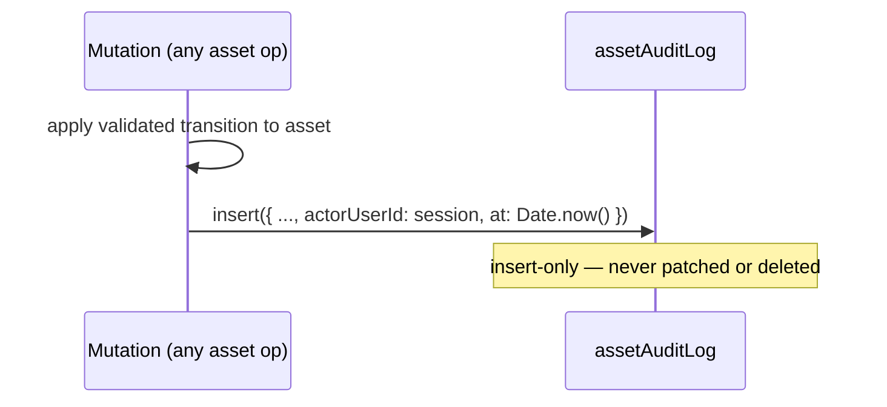

# GatherHub — KitTrace (Asset Tracking)

KitTrace is GatherHub's asset and kit tracking module. It tracks club property —
uniforms, kit bags, balls, training equipment, goals, gazebos, first-aid kits,
keys, devices, vehicles and more — with QR/NFC tags, custodian and location
tracking, a lifecycle state machine, sponsor links, and an **immutable** audit
log of every operation.

This is the differentiator versus chat-first apps: clubs lose real money to lost
kit, and KitTrace makes "who has the gazebo and when is it due back?" a one-scan
answer.

---

## 1. Asset fields

The `assets` table (full definition in `data-model.md`):

| Field | Type | Purpose |
| --- | --- | --- |
| `orgId` | `Id<"organisations">` | Owning club (server-derived). |
| `name` | string | Human label, e.g. "Senior gazebo #2". |
| `category` | enum | See categories below. |
| `status` | enum | Current lifecycle state. |
| `description` | string? | Free text. |
| `serialNumber` | string? | Manufacturer / club serial. |
| `purchaseDate` | ISO date? | When acquired. |
| `purchaseCost` | number? | Cost in minor units (cents). |
| `condition` | enum? | new / good / fair / poor. |
| `photoStorageId` | `string?` | Compatibility field name; stores an R2 object key for photo uploads. |
| `homeLocation` | string? | Default storage location. |
| `currentLocation` | string? | Where it is now. |
| `custodianMemberId` | `Id<"members">?` | Who currently holds it. |
| `assignedTeamId` | `Id<"teams">?` | Team it belongs to, if any. |
| `checkedOutAt` | epoch ms? | When current checkout started. |
| `dueBackAt` | epoch ms? | Expected return. |
| `notes` | string? | Operational notes. |
| `retiredAt` | epoch ms? | When retired. |

Related tables: `assetTags` (QR/NFC ids), `assetAuditLog` (immutable history),
`sponsoredAssets` (sponsor links).

---

## 2. Categories

| Value | Label |
| --- | --- |
| `uniform` | Uniform |
| `kit_bag` | Kit Bag |
| `ball` | Ball |
| `training_equipment` | Training Equipment |
| `goal` | Goal |
| `gazebo` | Gazebo |
| `first_aid` | First Aid |
| `key` | Key |
| `device` | Device |
| `vehicle` | Vehicle |
| `other` | Other |

---

## 3. Statuses

| Value | Label | Meaning |
| --- | --- | --- |
| `available` | Available | At home location, ready to be taken. |
| `checked_out` | Checked Out | In the custody of a member (signed out). |
| `in_use` | In Use | Actively deployed (e.g. at a match), often a sub-state of checked out. |
| `maintenance` | Maintenance | Being repaired / serviced; not usable. |
| `lost` | Lost | Reported missing. |
| `retired` | Retired | End of life; no longer tracked operationally. |

---

## 4. Lifecycle / state machine



Notes:
- **Transfer** changes `custodianMemberId` while remaining in Checked Out / In
  Use — no detour through Available.
- **In Use** is a refinement of being checked out (e.g. the gazebo is up at the
  ground), enabling clearer reporting.
- **Retired** is terminal for operations; the asset and its audit history are
  retained for the record but excluded from active lists.
- Every transition is enforced server-side; illegal transitions (e.g.
  Retired → Checked Out) are rejected.

---

## 5. Asset operations

Each operation is an authenticated, org- and role-checked Convex mutation that
applies a valid transition and appends an immutable audit entry. The client
sends the tag id (or asset id) plus minimal inputs; the server resolves the rest.

| Operation | Transition | Required role | Records |
| --- | --- | --- | --- |
| **Create** | → Available | committee+ | created |
| **Edit** | (no status change) | committee+ | edited (changed fields in metadata) |
| **Generate QR** | (none) | committee+ | qr_generated (new `assetTags` row, kind `qr`) |
| **Register NFC** | (none) | committee+ | nfc_registered (new `assetTags` row, kind `nfc`) |
| **Check out** | Available → Checked Out | coach/volunteer+ | checked_out (custodian, location, dueBackAt) |
| **Check in** | Checked Out / In Use / Lost → Available | coach/volunteer+ | checked_in (clears custodian, location) |
| **Transfer** | Checked Out/In Use → same (new custodian) | coach/volunteer+ | transferred (from/to custodian) |
| **Mark in use** | Checked Out → In Use | coach/volunteer+ | edited / metadata |
| **Report lost** | any active → Lost | coach/volunteer+ (volunteer report-only) | reported_lost |
| **Mark maintenance** | any active → Maintenance / end → Available | coach/committee+ | maintenance_started / maintenance_ended |
| **Retire** | Available/Maintenance/Lost → Retired | committee+ | retired |
| **View history** | (read) | asset-view roles | — (read of audit log) |

Example mutation (check out):

```ts
export const checkOut = mutation({
  args: {
    tagId: v.string(),
    custodianMemberId: v.id("members"),
    location: v.optional(v.string()),
    dueBackAt: v.optional(v.number()),
  },
  handler: async (ctx, args) => {
    const { orgId, userId } = await requireRole(ctx, "volunteer");

    const tag = await ctx.db
      .query("assetTags")
      .withIndex("by_tagId", (q) => q.eq("tagId", args.tagId))
      .unique();
    if (!tag || !tag.active || tag.orgId !== orgId) throw new Error("Not found");

    const asset = await ctx.db.get(tag.assetId);
    if (!asset || asset.orgId !== orgId) throw new Error("Not found");
    if (asset.status !== "available") throw new Error("Asset not available");

    const custodian = await ctx.db.get(args.custodianMemberId);
    if (!custodian || custodian.orgId !== orgId) throw new Error("Invalid custodian");

    await ctx.db.patch(asset._id, {
      status: "checked_out",
      custodianMemberId: args.custodianMemberId,
      currentLocation: args.location ?? asset.currentLocation,
      checkedOutAt: Date.now(),
      dueBackAt: args.dueBackAt,
    });

    await appendAuditLog(ctx, {
      orgId, assetId: asset._id, action: "checked_out", actorUserId: userId,
      fromStatus: "available", toStatus: "checked_out",
      toCustodianMemberId: args.custodianMemberId, location: args.location,
    });
  },
});
```

---

## 6. Immutable audit log design

`assetAuditLog` is append-only — the system of record for asset history.

- **Append-only:** written exclusively by the internal `appendAuditLog` helper.
  There is no mutation that patches, replaces, or deletes audit rows — for any
  role, including Owner.
- **Server-authored fields:** `actorUserId` comes from the authenticated session
  and `at` from the server clock (`Date.now()`), so clients cannot spoof who or
  when.
- **What's captured per entry:** `assetId`, `action`, `actorUserId`, `at`,
  `fromStatus`/`toStatus`, `fromCustodianMemberId`/`toCustodianMemberId`,
  `location`, optional `note`, and `metadata` (action-specific, e.g. changed
  fields on an edit).
- **Reads:** history is read via `by_asset_at` index for a chronological view on
  `AssetDetailView` (web + iOS).



---

## 7. QR / NFC tag design

Tags carry an **opaque** tag id only — never asset data, member data, or org
structure.

- Tag id format: `tag_` + random token, e.g. `tag_abc123`.
- Stored in `assetTags` with `kind` (`qr` | `nfc`), `assetId`, `orgId`, `active`.
- `tagId` is globally unique with a `by_tagId` index for fast resolution.
- One asset can have multiple tags (e.g. a QR sticker **and** an NFC tag).

Encoded payloads:

| Channel | Payload |
| --- | --- |
| QR code | `https://app.gatherhub.au/a/tag_abc123` |
| NFC (NDEF) | `https://app.gatherhub.au/a/tag_abc123` and/or `gatherhub://asset/tag_abc123` |
| App deep link | `gatherhub://asset/tag_abc123` |

Resolution & safety (see `security-model.md`):
1. A scan/visit hits the public route `/a/:tagId`.
2. The backend resolves the tag. If missing/inactive → minimal not-found page.
3. The unauthenticated landing exposes **no private data** — at most "this is a
   registered club asset" plus a sign-in / return-instructions prompt.
4. Full asset detail and operations require an authenticated session whose org
   matches the tag's org and a sufficient role.

Deactivating a tag (`active: false`) immediately breaks lookups for that
sticker/tag without affecting the asset or its other tags.

---

## 8. Sponsored-asset links

`sponsoredAssets` links a sponsor to assets they fund or brand (e.g. a
sponsor-branded gazebo, or team kit a sponsor paid for).

- Fields: `orgId`, `sponsorId`, `assetId`, optional `note`.
- An asset can have multiple sponsor links; a sponsor can fund many assets.
- Surfaced on the asset detail (and optionally on the public site when
  `publicSiteSettings.showSponsors` is enabled) to recognise sponsors.
- Managing sponsor links is a committee+/sponsor-management capability.

---

## 9. Custodian & location tracking

- **Custodian:** `assets.custodianMemberId` holds the current holder while
  Checked Out / In Use; cleared on check-in. Custody changes (check-out, transfer,
  check-in) are all reflected in the audit log via `from/toCustodianMemberId`.
- **Location:** `homeLocation` is the default storage spot; `currentLocation`
  tracks where the asset is now and is updated on check-out / check-in / transfer.
  The location at the time of each operation is also captured in the audit entry.
- **Overdue:** `dueBackAt` enables overdue reporting — assets past due while
  still Checked Out / In Use can be flagged on dashboards and to custodians.
- Together these answer the core club question at any moment: *what is it, where
  is it, who has it, and when is it due back* — with a complete, tamper-evident
  history of how it got there.
