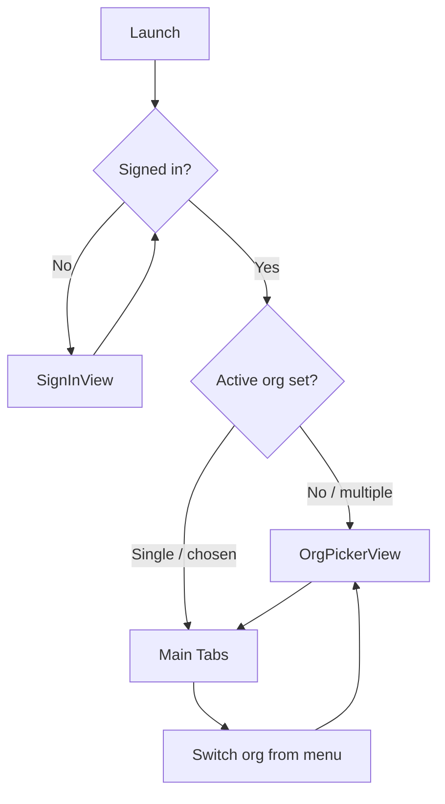
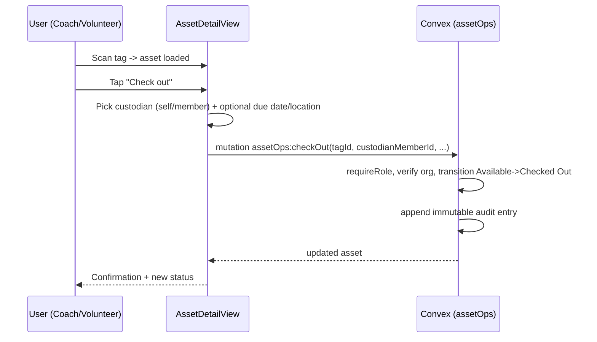

# GatherHub — iOS / Mobile Architecture

The iOS app (`/ios`) is the **field-ops companion** to the web admin console. It
is intentionally focused: scan kit, look up assets, check things out and back in,
view your events, and RSVP. It is **not** a full admin tool — member/team/sponsor
administration lives on the web.

- **Stack:** SwiftUI, Clerk iOS SDK (auth + organisations), Convex Swift client.
- **Backend:** talks directly to Convex with a Clerk-authenticated session
  (same model as the web app — see `architecture.md`).
- **Hardware:** QR scanning via AVFoundation, NFC scanning via Core NFC.

---

## 1. App structure

```text
ios/GatherHub/
├── App/
│   ├── GatherHubApp.swift        # @main; injects Clerk + Convex into environment
│   ├── RootView.swift            # routes between Auth / OrgPicker / Main tabs
│   └── AppEnvironment.swift      # shared services container
├── Services/
│   ├── ClerkService.swift        # Clerk session, active org, JWT for Convex
│   ├── ConvexService.swift       # ConvexClient configured with Clerk auth
│   ├── ScannerService.swift      # AVFoundation QR capture
│   └── NFCService.swift          # Core NFC read sessions
├── Features/
│   ├── Auth/                     # SignInView, OrgPickerView
│   ├── Scan/                     # ScanView (QR + NFC entry points)
│   ├── Assets/                   # AssetLookupView, AssetDetailView, CheckOut/InView, TransferView
│   ├── Events/                   # EventListView, EventDetailView (RSVP)
│   └── Common/                   # error/empty/loading states, banners
├── Models/                       # Codable DTOs mirroring Convex docs
└── Resources/                    # Info.plist (camera + NFC usage strings), assets
```

Architecture pattern: SwiftUI views backed by lightweight `@Observable`
view-models. View-models call `ConvexService` (queries return values; mutations
return on completion). State that must stay live (event list, asset status) uses
Convex subscriptions surfaced as `@Published`/observable streams.

---

## 2. Clerk iOS auth

- The Clerk iOS SDK is configured with the production publishable key at launch.
- Sign-in supports the methods enabled in Clerk (email + password, OAuth, magic
  link / OTP) — the SDK provides the flows.
- After sign-in, `ClerkService` exposes the current user and the list of
  organisations the user belongs to.
- For Convex, `ClerkService` mints a session JWT using the `convex` JWT template
  and provides a token-fetch closure to the Convex client. The token carries the
  **active org** claim.

```swift
// ClerkService provides the auth callback Convex uses for every request.
let convex = ConvexClient(
    deploymentUrl: AppConfig.convexUrl,
    fetchToken: { try await Clerk.shared.session?.getToken(template: "convex")?.jwt }
)
```

---

## 3. Convex Swift client setup

- `ConvexService` wraps `ConvexClient` configured with the Convex deployment URL
  and the Clerk token provider above.
- Queries: `convex.subscribe(to: "events:list")` for reactive lists, or one-shot
  reads for detail screens.
- Mutations: `convex.mutation("assetOps:checkOut", with: [...])`.
- Because the org id is derived server-side from the JWT, the app **never** sends
  an org id. Switching the active org (below) changes the token, which changes
  what the backend returns — no client-side org filtering.

---

## 4. Organisation selection



- If the user belongs to one org, it is selected automatically.
- If multiple, `OrgPickerView` lets them choose; the choice sets Clerk's active
  organisation, so the next minted JWT carries the new `org_id`.
- An org switcher is reachable from the main screen for users in several clubs.

---

## 5. Asset lookup

Three ways to reach an asset:
1. **Scan QR** (AVFoundation) → resolves opaque `tagId`.
2. **Scan NFC** (Core NFC) → resolves opaque `tagId`.
3. **Manual search** by name/serial (org-scoped query).

All three converge on `AssetDetailView`, which loads the asset via an
authenticated, org/role-checked Convex query. If the scanned tag belongs to a
different org or the user lacks asset-view permission, the app shows a minimal
"not available" state (consistent with the security model).

---

## 6. QR scanning (AVFoundation)

- `ScannerService` runs an `AVCaptureSession` with an
  `AVCaptureMetadataOutput` filtered to `.qr`.
- On a successful read, the payload is expected to be a GatherHub asset URL or
  deep link:
  - `https://app.gatherhub.au/a/tag_abc123`
  - `gatherhub://asset/tag_abc123`
- The service extracts `tag_abc123`, then calls Convex to resolve and load the
  asset. Non-GatherHub QR payloads are rejected with a clear message.
- `Info.plist` includes `NSCameraUsageDescription`.

---

## 7. NFC scanning (Core NFC)

- `NFCService` starts an `NFCNDEFReaderSession` (NDEF) to read tags written with
  the same URL/deep-link payload as QR.
- The tag id is extracted identically to the QR path, so downstream lookup is
  shared.
- Registering/writing NFC tags is an **admin/committee** action and is primarily
  a web flow; the iOS app focuses on **reading** tags in the field. (Writing, if
  enabled, requires the asset-management role and uses
  `NFCNDEFReaderSession` write APIs.)
- `Info.plist` includes `NFCReaderUsageDescription` and the NFC entitlement; NFC
  is iPhone-only and unavailable on unsupported devices (handled gracefully).

---

## 8. Check-out / check-in / transfer flows



- **Check out:** Available → Checked Out (records custodian, location, optional
  due-back).
- **Check in:** Checked Out / In Use → Available (clears custodian, records
  location).
- **Transfer:** hands custody to a different member without a round-trip through
  Available.
- **Report lost / start maintenance:** field users can report; the backend
  applies the transition and logs it.
- Every operation is a Convex mutation that enforces role + org and writes the
  append-only audit log. The app submits the **scanned tag id** plus minimal
  inputs; the server resolves everything else. See `kittrace.md` for the full
  state machine.

---

## 9. Event list + RSVP

- `EventListView` subscribes to the org's upcoming events (reactive).
- `EventDetailView` shows details and the user's current RSVP.
- RSVP is a mutation setting `going` / `not_going` / `maybe`. Parents can RSVP on
  behalf of their linked children (server validates the guardian relationship).
- Attendance recording can be exposed to coaches/volunteers assigned to the
  event (role-checked server-side).

---

## 10. Offline-friendly error states

The MVP is **online-first** but degrades gracefully:

- Connectivity loss surfaces a non-blocking banner ("Offline — changes can't be
  saved right now") rather than a crash.
- Reads show the last known cached value where the Convex client provides it,
  flagged as potentially stale.
- Mutations performed while offline are blocked with a clear retry affordance;
  the app does **not** silently queue writes (avoids ambiguous asset state).
- Camera/NFC unavailable states (permission denied, hardware unsupported) show
  explicit guidance with a path to Settings.
- All Convex errors (auth expired, insufficient permission, not found) map to
  human-readable messages; auth-expiry triggers a silent token refresh, then a
  sign-in prompt if that fails.

---

## 11. Screen list

| Screen | Purpose | Key role(s) |
| --- | --- | --- |
| SignInView | Clerk sign-in | all |
| OrgPickerView | Choose / switch active club | multi-club users |
| HomeView (tabs) | Entry to Scan / Assets / Events | all |
| ScanView | QR + NFC scan entry | coach, volunteer, committee+ |
| AssetLookupView | Search assets by name/serial | asset-view roles |
| AssetDetailView | Asset info, status, history, actions | asset-view roles |
| CheckOutView | Check out an asset | check-out roles |
| CheckInView | Check in an asset | check-out roles |
| TransferView | Transfer custody | check-out roles |
| ReportIssueView | Report lost / needs maintenance | check-out roles |
| EventListView | Upcoming events | all |
| EventDetailView | Event detail + RSVP (+ attendance) | all / coach for attendance |
| ProfileView | User, active org, sign out | all |

---

## 12. Data-flow note

The iOS app uses **the same direct-to-Convex model as the web app**: Clerk
manages identity and the active organisation; the Clerk JWT is attached to every
Convex call; Convex verifies the token, derives the `orgId` and role server-side,
enforces permissions, and (for asset ops) writes the immutable audit log. The
app sends opaque tag ids and minimal inputs and trusts the server for
authorisation and state transitions. There is no separate mobile API; the only
unauthenticated surface the app may touch is the public QR landing route, which
exposes no private data.
