# GatherHub — MVP Roadmap

This roadmap defines the scope and build order for GatherHub v0.1 — the open-source
MVP "operating system for community sports clubs". It is organised into 16 epics,
sequenced so each builds on the last.

Detailed, per-issue breakdowns live under [`/docs/issues/`](./issues/).

---

## MVP scope boundaries

GatherHub is **not** a chat-first app. For v0.1 we deliberately exclude:

- **NO chat / messaging.** Announcements (one-way) only — no DMs or group chat.
- **NO payments / billing / fees.** No payment provider integration in v0.1
  (the REST surface reserves a slot for it later).
- **NO AI features.** No recommendations, summaries, or generative anything.

In scope: people, teams, events, attendance, announcements, **KitTrace** asset
tracking with QR/NFC, volunteers, sponsors, a basic public website, and a
field-ops iOS app — all multi-tenant via Clerk organisations, all on Convex.

---

## The 16 epics

| # | Epic | Summary |
| --- | --- | --- |
| 1 | **Project Foundation** | Monorepo, `/web` (Vite + React 18 + TS + React Router v6 + Tailwind + shadcn/Radix), `/web/convex`, `/ios` skeleton, lint/format/CI, env config. |
| 2 | **Auth & Multi-Tenancy** | Clerk auth (sign in/up), Clerk Organisations 1:1 → clubs, org switcher, `convex` JWT template, Convex `auth.config.ts`, `requireOrgMember`/`requireRole` helpers, Clerk→Convex user/org sync webhook. |
| 3 | **Members & Teams** | `members` (people, may not be users), guardians, emergency contacts, teams, team assignments (player/coach/manager), medical-notes redaction. |
| 4 | **Events & Attendance** | Events (training/match/meeting), RSVPs (going/not_going/maybe), attendance recording, parent-RSVP-for-child. |
| 5 | **Announcements** | Club/team announcements, pinning, read receipts. |
| 6 | **KitTrace Asset Tracking** | `assets` (full field set), categories, statuses, custodian/location, asset CRUD, photos. |
| 7 | **Asset Operations & Audit Log** | Check-out/in, transfer, mark in use, report lost, maintenance, retire; immutable append-only `assetAuditLog`. |
| 8 | **QR & NFC Workflows** | Opaque `assetTags`, QR generation, NFC registration, public `/a/:tagId` landing, deep links, safe permission-gated resolution. |
| 9 | **Volunteers** | Volunteer records, certifications/clearances (WWCC, First Aid, coaching), expiry tracking/reminders, document upload. |
| 10 | **Sponsors** | Sponsors, tiers, contracts, logos, sponsored-asset links. |
| 11 | **Public Website** | Per-org `publicSiteSettings`, news/posts, public-facing club page, optional sponsor display. |
| 12 | **iOS App** | SwiftUI field-ops app: Clerk iOS auth, Convex Swift client, org selection, asset lookup, QR (AVFoundation) + NFC (Core NFC), check-out/in/transfer, events + RSVP, offline-friendly errors. |
| 13 | **Reporting & Dashboards** | Asset status overview, overdue/checked-out kit, attendance summaries, certification-expiry alerts, sponsor overview. |
| 14 | **Security & Compliance** | Org-scoping audit, RBAC matrix verification, file-upload validation, rate limiting, medical-notes restriction, audit-log immutability checks. |
| 15 | **Testing & Quality** | Unit/integration tests for Convex functions (auth, scoping, transitions), component tests, e2e happy paths, iOS smoke tests. |
| 16 | **Documentation & Launch** | These docs, contributor guide, deployment guide, demo data/seed, v0.1 release. |

---

## Implementation order

```mermaid
flowchart LR
    F[1. Foundation] --> A[2. Auth]
    A --> O[2. Orgs / Multi-tenancy]
    O --> M[3. Members]
    M --> T[3. Teams]
    T --> E[4. Events & Attendance]
    E --> AN[5. Announcements]
    AN --> K[6. KitTrace]
    K --> AO[7. Asset Ops & Audit]
    AO --> Q[8. QR & NFC]
    Q --> V[9. Volunteers]
    V --> S[10. Sponsors]
    S --> P[11. Public Website]
    P --> I[12. iOS App]
    I --> R[13-16. Reporting / Security / Testing / Docs]
```

The canonical sequence:

**foundation → auth → orgs → members → teams → events → KitTrace → QR/NFC →
volunteers → sponsors → public website → iOS**, with reporting, security
hardening, testing, and documentation woven through and completed before launch.

Rationale: nothing is usable without the foundation, auth, and org-scoping
(epics 1–2). People/teams (3) are the backbone most other features reference.
Events/announcements (4–5) are quick wins that exercise the member model.
KitTrace (6–8) is the flagship differentiator and is built once the org/member
substrate is solid. Volunteers and sponsors (9–10) reuse the member/asset
models. The public website (11) surfaces existing data. iOS (12) consumes the
now-stable Convex functions for field ops. Cross-cutting epics (13–16) harden and
ship.

---

## v0.1 — Definition of Done

v0.1 is done when a real club can run day-to-day operations end to end:

**Platform**
- [ ] Monorepo builds; `/web` (Vite/React/TS) and `/web/convex` deploy; `/ios`
      builds and runs.
- [ ] Clerk auth works; Clerk Organisations map 1:1 to clubs; org switcher works;
      Convex verifies the Clerk JWT on every call.
- [ ] All tenant data is org-scoped server-side; no client-supplied `orgId` is
      trusted; cross-tenant access is impossible.

**Functional**
- [ ] Create a club; invite users; assign roles (Owner/Admin/Committee/Coach/
      Volunteer/Parent/Player).
- [ ] Manage members (incl. non-user members), guardians, emergency contacts;
      medical notes are role-restricted.
- [ ] Create teams and assign players/coaches/managers.
- [ ] Create events; members RSVP (going/not_going/maybe); attendance recorded.
- [ ] Post announcements (club/team) with read receipts.
- [ ] **KitTrace:** create assets across all categories; generate QR; register
      NFC; check out/in; transfer; report lost; maintenance; retire — each
      writing an **immutable** audit entry.
- [ ] Scan a QR/NFC tag (web + iOS) and resolve to the asset with permission
      gating; public landing leaks no private data.
- [ ] Track volunteers and certifications with expiry visibility.
- [ ] Manage sponsors and link sponsored assets.
- [ ] Publish a basic public website per club (news + info, optional sponsors).
- [ ] iOS field-ops app: sign in, pick org, look up/scan assets, check
      out/in/transfer, view events, RSVP, graceful offline errors.

**Quality & security**
- [ ] RBAC matrix enforced server-side and covered by tests.
- [ ] File uploads validated (content-type/size); basic rate limiting in place.
- [ ] Audit log proven append-only (no update/delete path).
- [ ] Core Convex functions and key flows have automated tests; CI green.

**Launch**
- [ ] Architecture, data-model, security, mobile, KitTrace, and roadmap docs
      complete (this set).
- [ ] Deployment guide + seed/demo data; v0.1 tagged and released.

**Explicitly out of scope for v0.1:** chat/messaging, payments/fees, and any AI
features.

---

## Detailed issues

Per-epic, per-issue breakdowns (acceptance criteria, dependencies, estimates)
live under [`/docs/issues/`](./issues/).
