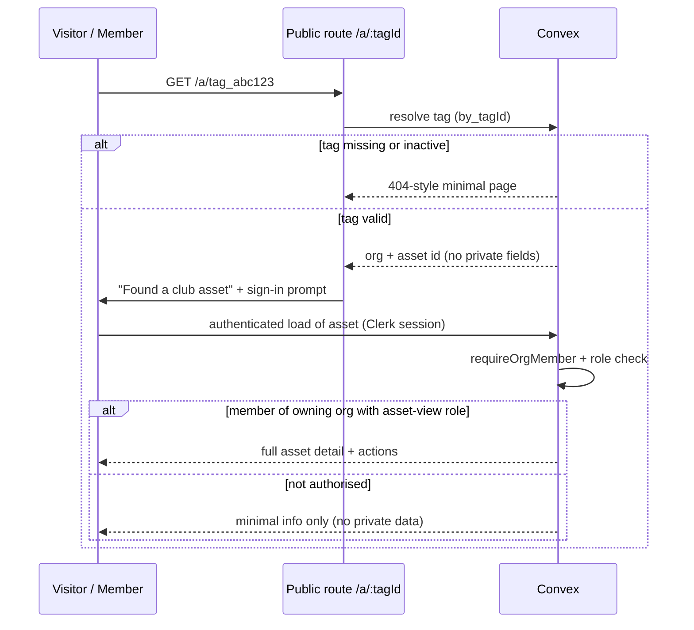

# GatherHub — Security Model

GatherHub is multi-tenant: many clubs share one Convex backend. The security
model has one non-negotiable rule and several supporting layers.

> **Golden rule:** every authenticated query/mutation derives `orgId` from the
> verified Clerk session. The client's organisation id is **never** trusted.

---

## 1. Organisation-scoped data isolation

Each club is a Clerk organisation mapped 1:1 to a GatherHub tenant. The active
org rides in the Clerk JWT (`org_id`, `org_role`). Convex verifies the JWT and
exposes the identity via `ctx.auth.getUserIdentity()`.

### How orgId is resolved (server side, every call)

```ts
// convex/lib/auth.ts
import { QueryCtx, MutationCtx } from "../_generated/server";

export async function requireOrgMember(ctx: QueryCtx | MutationCtx) {
  const identity = await ctx.auth.getUserIdentity();
  if (!identity) throw new Error("Unauthenticated");

  // org_id comes from the VERIFIED JWT claim — not from any function argument.
  const clerkOrgId = identity.orgId as string | undefined;
  if (!clerkOrgId) throw new Error("No active organisation");

  const org = await ctx.db
    .query("organisations")
    .withIndex("by_clerkOrgId", (q) => q.eq("clerkOrgId", clerkOrgId))
    .unique();
  if (!org) throw new Error("Unknown organisation");

  const user = await ctx.db
    .query("users")
    .withIndex("by_clerkUserId", (q) =>
      q.eq("clerkUserId", identity.subject),
    )
    .unique();
  if (!user) throw new Error("Unknown user");

  const membership = await ctx.db
    .query("memberships")
    .withIndex("by_org_user", (q) =>
      q.eq("orgId", org._id).eq("userId", user._id),
    )
    .unique();
  if (!membership || !membership.active) throw new Error("Not a member");

  return { orgId: org._id, userId: user._id, role: membership.role };
}
```

**Every** read and write then filters by that server-derived `orgId`:

```ts
// convex/members.ts
export const list = query({
  args: {},
  handler: async (ctx) => {
    const { orgId } = await requireOrgMember(ctx);
    return ctx.db
      .query("members")
      .withIndex("by_org", (q) => q.eq("orgId", orgId)) // server-derived only
      .collect();
  },
});
```

Even when a function takes an `Id<"members">` argument, it must **re-check** that
the fetched document's `orgId` equals the caller's `orgId` before acting on it.
A valid id from another tenant must be rejected:

```ts
const member = await ctx.db.get(args.memberId);
if (!member || member.orgId !== orgId) throw new Error("Not found");
```

> Clients never pass `orgId`. There is no function signature in the codebase
> that accepts an org id from the caller.

---

## 2. Role-based permissions

Roles, most → least privileged: **Owner, Admin, Committee, Coach, Volunteer,
Parent, Player**. Roles are taken from the membership row (mapped from the Clerk
`org_role` claim).

### Server-side checks: `requireRole`

```ts
const ROLE_RANK = {
  owner: 6, admin: 5, committee: 4, coach: 3, volunteer: 2, parent: 1, player: 0,
} as const;

export async function requireRole(
  ctx: QueryCtx | MutationCtx,
  minRole: keyof typeof ROLE_RANK,
) {
  const auth = await requireOrgMember(ctx);
  if (ROLE_RANK[auth.role] < ROLE_RANK[minRole]) {
    throw new Error("Insufficient permissions");
  }
  return auth;
}

// Or an explicit allow-list when ranking doesn't fit:
export async function requireAnyRole(
  ctx: QueryCtx | MutationCtx,
  allowed: Array<keyof typeof ROLE_RANK>,
) {
  const auth = await requireOrgMember(ctx);
  if (!allowed.includes(auth.role)) throw new Error("Insufficient permissions");
  return auth;
}
```

Permission checks live **only on the server**. The web/iOS UI hides controls a
role can't use, but that is a convenience, not a security boundary — the
mutation re-checks regardless.

### Permissions matrix (role × capability)

Legend: ✅ full · 🟡 limited/own-scope · ❌ none.

| Capability | Owner | Admin | Committee | Coach | Volunteer | Parent | Player |
| --- | --- | --- | --- | --- | --- | --- | --- |
| **Members — view** | ✅ | ✅ | ✅ | 🟡 own teams | ❌ | 🟡 own children | 🟡 self |
| **Members — create/edit** | ✅ | ✅ | ✅ | ❌ | ❌ | 🟡 own children | ❌ |
| **Members — delete** | ✅ | ✅ | ❌ | ❌ | ❌ | ❌ | ❌ |
| **Medical notes — view** | ✅ | ✅ | 🟡 committee policy | 🟡 own team only | ❌ | 🟡 own children | ❌ |
| **Teams — view** | ✅ | ✅ | ✅ | ✅ | ✅ | ✅ | ✅ |
| **Teams — create/edit/assign** | ✅ | ✅ | ✅ | 🟡 own teams | ❌ | ❌ | ❌ |
| **Events — view** | ✅ | ✅ | ✅ | ✅ | ✅ | ✅ | ✅ |
| **Events — create/edit** | ✅ | ✅ | ✅ | 🟡 own teams | ❌ | ❌ | ❌ |
| **RSVP — submit** | ✅ | ✅ | ✅ | ✅ | ✅ | 🟡 for children | 🟡 self |
| **Attendance — record** | ✅ | ✅ | ✅ | ✅ | 🟡 if assigned | ❌ | ❌ |
| **Announcements — view** | ✅ | ✅ | ✅ | ✅ | ✅ | ✅ | ✅ |
| **Announcements — author** | ✅ | ✅ | ✅ | 🟡 own teams | ❌ | ❌ | ❌ |
| **Assets — view** | ✅ | ✅ | ✅ | ✅ | ✅ | ❌ | ❌ |
| **Assets — create/edit/retire** | ✅ | ✅ | ✅ | ❌ | ❌ | ❌ | ❌ |
| **Asset ops — check out/in/transfer** | ✅ | ✅ | ✅ | ✅ | ✅ | ❌ | ❌ |
| **Asset ops — report lost / maintenance** | ✅ | ✅ | ✅ | ✅ | 🟡 report only | ❌ | ❌ |
| **Asset — generate QR / register NFC** | ✅ | ✅ | ✅ | ❌ | ❌ | ❌ | ❌ |
| **Volunteers/certifications — manage** | ✅ | ✅ | ✅ | ❌ | 🟡 own | ❌ | ❌ |
| **Sponsors — manage** | ✅ | ✅ | ✅ | ❌ | ❌ | ❌ | ❌ |
| **Public site — edit** | ✅ | ✅ | 🟡 if granted | ❌ | ❌ | ❌ | ❌ |
| **Audit log — view** | ✅ | ✅ | ✅ | 🟡 own actions | ❌ | ❌ | ❌ |
| **Audit log — modify/delete** | ❌ | ❌ | ❌ | ❌ | ❌ | ❌ | ❌ |
| **Org settings / billing** | ✅ | 🟡 settings only | ❌ | ❌ | ❌ | ❌ | ❌ |

> The audit log is immutable for **everyone**, including Owner — there is no
> mutation that updates or deletes audit rows.

---

## 3. Audit logging for asset operations (immutable)

`assetAuditLog` is **append-only**:

- Written only by a single internal helper (`appendAuditLog`) called inside asset
  mutations. There is **no** update or delete mutation for the table.
- Each row records: `assetId`, `action`, `actorUserId` (from session, not
  client), `at` (server clock, `Date.now()`), status transition, custodian
  transition, location, and optional note/metadata.
- The actor is always the authenticated user; clients cannot spoof it.
- See `kittrace.md` for the full action list and lifecycle.

```ts
async function appendAuditLog(ctx: MutationCtx, entry: AuditEntry) {
  await ctx.db.insert("assetAuditLog", { ...entry, at: Date.now() });
  // No code path ever calls ctx.db.patch/replace/delete on assetAuditLog.
}
```

---

## 4. Safe public QR/NFC routes

QR codes and NFC tags encode an **opaque** tag id only — never asset data,
member data, or org identifiers that leak structure.

- URL form: `https://app.gatherhub.au/a/tag_abc123`
- Deep link: `gatherhub://asset/tag_abc123`

Resolution flow:



Rules:
- The unauthenticated landing page shows **no private data** — at most "this is a
  registered club asset" plus a sign-in/return-instructions prompt.
- Full asset detail and operations require an authenticated session whose
  org matches the tag's org **and** sufficient role (asset-view+).
- Tag ids are random and opaque; they are not guessable sequences and reveal no
  org structure.
- Inactive/deactivated tags resolve to a not-found page.

---

## 5. Secure file upload validation

All uploads go to **Convex file storage** via a server-issued upload URL.

- Mutations issue a short-lived upload URL (`ctx.storage.generateUploadUrl()`)
  only to authenticated, authorised callers.
- After upload, a mutation records the resulting `storageId` against a document,
  re-checking `orgId` and role.
- **Validation on confirm:** the server checks the stored file's
  `contentType` against an allow-list per use-case (e.g. images:
  `image/png`, `image/jpeg`, `image/webp`; certificate docs additionally
  `application/pdf`) and rejects/deletes anything outside the limit.
- **Size limits** are enforced per use-case (e.g. logos/photos ≤ 5 MB, documents
  ≤ 15 MB); oversized files are rejected and the storage object deleted.
- File `storageId`s are only ever surfaced through org-scoped, role-checked
  queries that return signed URLs — raw storage ids are not public.

---

## 6. Rate limiting

For an MVP the approach is layered and lightweight:

- **Clerk** rate-limits authentication endpoints (sign-in/up, OTP) out of the box.
- **Convex public HTTP routes** (QR resolution, webhooks, invite links) apply a
  per-IP / per-token token-bucket counter stored in a small `rateLimits` table
  (keyed by route + identifier, with a windowed count) and reject over-limit
  requests with HTTP 429.
- **Mutations** that can be abused (e.g. invite creation, bulk import) carry a
  per-user/per-org window check using the same pattern.
- Webhook endpoints verify signatures before doing any work, so unsigned floods
  are cheap to drop.

> This is deliberately simple for v0.1; a dedicated rate-limit component can be
> swapped in later without changing call sites.

---

## 7. Medical-notes restricted visibility

`members.medicalNotes` is sensitive and gated beyond normal member-view:

- Server-side, `medicalNotes` is **stripped** from list/detail query results
  unless the caller passes a role/relationship check:
  - Owner / Admin: always.
  - Committee: per club policy (default allowed).
  - Coach: only for members on a team they coach.
  - Parent/Guardian: only for their own linked children.
  - Volunteer / Player: never.
- The field is removed in the query handler before returning — clients never
  receive it when unauthorised, rather than being hidden only in the UI.
- Access to medical notes is a candidate for its own audit trail in a later
  version.

```ts
function redactMember(member, viewer, canSeeMedical: boolean) {
  if (canSeeMedical) return member;
  const { medicalNotes, ...safe } = member;
  return safe; // medical notes never leave the server
}
```

---

## 8. Summary of guarantees

| Threat | Mitigation |
| --- | --- |
| Cross-tenant data access | `orgId` from verified JWT; every query/mutation filters by it; fetched docs re-checked against caller org. |
| Privilege escalation | Server-side `requireRole`/`requireAnyRole`; UI gating is non-authoritative. |
| Audit tampering | Append-only `assetAuditLog`; no update/delete code paths. |
| QR/NFC data leakage | Opaque tag ids; no private data on unauthenticated landing; permission check before detail. |
| Malicious uploads | Server-issued upload URLs; content-type + size validation; org/role checks; redacted access. |
| Abuse / flooding | Layered rate limiting on auth, public HTTP routes, and sensitive mutations. |
| Sensitive PII exposure | Medical notes redacted server-side based on role/relationship. |
